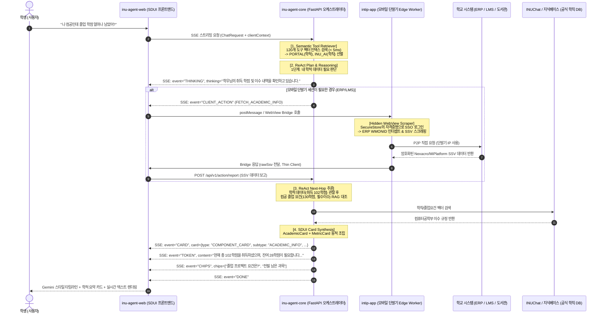

# 인천대학교 AI 캠퍼스 비서 에이전트(챗불이) 프로젝트 포트폴리오 & 이력서 정리 가이드

> **대상 프로젝트 및 레포지토리:**
> - `inu-agent-core` (FastAPI / LiteLLM / Semantic Tool RAG / ReAct Agent Engine)
> - `inu-agent-web` (React / TypeScript / Tailwind / SDUI Renderer / Web Client)
> - `intip-app` (`intip-mobile-app` - React Native / Expo / Edge Action Worker / Local Sniper)
> - *(연계 백엔드 & 웹)* `inu-portal-server` (Spring Boot), `inu-portal-web` (React)
>
> **작성자:** hjunieee (`hinara12@inu.ac.kr`)  
> **기준 커밋 로그 및 브랜치:** `inu-agent-core` (main), `inu-agent-web` (main), `intip-mobile-app` (`feat/ai-academic-sso-agent`), `inu-portal-server` (`feat/인팁-ai-캠퍼스-비서-오케스트레이터`)

---

## 1. 프로젝트 총괄 개요 (Executive Summary)

### 1.1 프로젝트 배경 및 해결하고자 한 문제
- **교내 정보 및 시스템 파편화**: 종합정보시스템(ERP 학적/성적), 이러닝(LMS 과제/강의), 학산도서관(열람실/스터디룸), 교내 버스 및 학식 정보가 각기 다른 웹/앱 시스템으로 분리되어 있어 학생들의 탐색 피로도가 극심했음.
- **학교 공식 오픈 API의 부재와 보안/법적 제약**:
  - 대학 ERP 및 도서관은 정식 REST API가 없거나 세션 인증(SSO 쿠키, WMONID 토큰 등)이 필수적임.
  - 학생들의 포털 계정(ID/PW)을 중앙 서버에 수집·저장할 경우 **개인정보보호법상 중대한 법적 리스크**가 발생함.
  - 중앙 서버에서 수천 명의 요청을 단일 IP로 학교 시스템에 스크래핑할 경우 **학교 웹방화벽(WAF)에 의해 서버 IP가 영구 차단**되는 치명적인 위험이 존재함.
- **기존 챗봇의 한계 (키워드/규칙 기반 및 단순 RAG)**:
  - 기존 챗봇은 단발성 텍스트 응답에 그쳐, "내 학점에 맞는 졸업 요건 분석", "지금 도서관 열람실 좌석 직접 신청", "버스 시간 맞춤 브리핑" 등 실제 사용자의 행동(Action)을 완결하지 못함.
  - 120개가 넘는 방대한 교내 API 엔드포인트를 소형/오픈소스 LLM(Gemma 27B 등)의 컨텍스트 윈도우에 효율적으로 주입하기 어려워 함수 호출(Function Calling) 환각(Hallucination)이 발생함.

### 1.2 핵심 솔루션: "Zero-Knowledge 하이브리드 AI 에이전트 시스템"
1. **서버(두뇌) + 클라이언트(손발 / Edge Worker) 하이브리드 아키텍처 구축**:
   - 중앙 서버는 의도 분석, 계획 수립, 도구 선별(Brain)만 수행하고, 외부 시스템과의 세션 통신은 사용자 모바일 단말기(Hands)가 수행하는 Zero-Knowledge 프로토콜 설계.
2. **In-Memory 시맨틱 도구 리트리버 (Tool RAG / Semantic Tool Retriever)**:
   - 120여 개의 OpenAPI 도구 메타데이터를 인메모리 벡터 인덱스로 관리하고, < 5ms 이내에 Dense Cosine Similarity + 동적 렉시컬 하이브리드 매칭으로 상위 3~4개 도구만 LLM에 정밀 주입하는 제로 하드코딩 아키텍처 구현.
3. **자율 ReAct 다단계 추론 체이닝 & 실시간 SSE 스트리밍**:
   - `THINKING` (생각) $\rightarrow$ `STATUS` (도구 실행) $\rightarrow$ `CARD` (SDUI) $\rightarrow$ `TOKEN` (답변) 흐름을 Gemini 스타일의 타임라인으로 실시간 시각화.
4. **Server-Driven UI (SDUI) 기반 생성형 컴포넌트 카드**:
   - 단순 텍스트 답변을 넘어 도서관 실시간 좌석 맵/배정 확정, 취소표 스나이퍼, 학적 요약, 버스/학식 카드 등 인터랙티브 UI를 동적으로 합성 및 렌더링.
5. **모바일 100% Thin Client화 및 백그라운드 스마트 감시(스나이퍼) 엔진**:
   - 모바일 앱 내부의 복잡한 파서와 비즈니스 로직을 완전 제거하고, 숨김 웹뷰 기반 SSO 인터셉트 및 로컬 백그라운드 취소표 알림 엔진(`LocalWatchManager`) 구현.

---

## 2. 시스템 아키텍처 및 설계 혁신 (Architecture & Innovations)

### 2.1 전체 시스템 시퀀스 및 토폴로지



---

### 2.2 4대 핵심 아키텍처 혁신 포인트

#### ① Zero-Knowledge & WAF-Bypass 하이브리드 액션 아키텍처
- **보안 및 법적 리스크 원천 차단 (Zero-Knowledge)**:
  - 학생의 포털/LMS ID 및 패스워드는 오직 단말기 OS 보안 영역(`Expo SecureStore` / iOS Keychain / Android KeyStore)에만 저장됨.
  - 중앙 서버의 DB 및 로그에는 학생의 자격증명이 단 1바이트도 기록되지 않음.
- **학교 웹 방화벽(WAF) IP 차단 방지**:
  - 중앙 서버가 대학 ERP를 집중 스크래핑하면 즉각적인 IP 블랙리스트에 등재됨.
  - 학생 본인의 단말기 네트워크(LTE/5G/Wi-Fi) IP를 통해 P2P로 직접 대학 서버와 통신하게 설계하여 분산 처리 및 차단 완벽 회피.
- **100% Thin Client 패턴 리팩터링**:
  - 기존에는 모바일 앱 내부에 ERP SSV 파서 및 비즈니스 로직이 포함되어 있어, 학교 ERP 필드나 컬럼명이 바뀌면 앱스토어 심사 및 강제 업데이트가 불가피했음.
  - 앱단 비즈니스 파서를 100% 제거하고 순수 액션 러너(Action Runner)로 전환. 파싱 및 비즈니스 조립은 `inu-agent-core`가 전담하여 무배포 실시간 대응 체계 달성.

#### ② In-Memory Semantic Tool Retriever (Tool RAG / 도구 다이어트 엔진)
- **문제점**:
  - 포털 서버의 OpenAPI 엔드포인트 120여 개를 LLM 컨텍스트에 모두 넣으면 토큰 비용 폭증, 레이턴시 급증, 함수 환각 발생.
  - 기존의 키워드 딕셔너리(`CATEGORY_KEYWORDS`)와 매직 넘버 점수제(`+10`, `-15`)는 새로운 API 추가 시마다 코드를 수정해야 하는 유지보수 병목 유발.
- **솔루션 (Tool RAG)**:
  - 서버 기동(Lifespan) 시 120개 도구의 메타데이터(이름, 설명, 파라미터 스키마)를 벡터화하여 L2 정규화 인메모리 인덱스 구축 (메모리 사용량 1MB 미만).
  - 런타임 질의 시 **Dense Cosine Similarity + Zero-Hardcoding 동적 렉시컬 매칭**을 결합하여 **< 5ms 이내**에 가장 적합한 도구 상위 3~4개만 동적 추출.
  - **멀티턴 맥락 증강(`_build_augmented_query`)**: 직전 4턴의 대화와 어시스턴트 발견 엔티티를 주입하여 "전화번호 알아?", "20학번은?" 같은 단축 질의에서도 이전 엔티티를 계승하여 정확한 도구를 탐색.
  - **동적 상대 점수 컷오프(Dynamic Relevance Cutoff)**: 1위 도구의 신뢰도가 매우 높을 경우(`>= 0.6`), 연관성이 떨어지는 저점수 도구를 엄격하게 걸러내어 LLM의 도구 혼선 방지.

#### ③ Context-Aware 파라미터 리졸버 & ReAct 자율 체이닝
- **생략된 엔티티 복원 (Entity Resolution)**:
  - 멀티턴 대화에서 사용자가 대상을 생략하고 "연구실 위치는?", "이메일 뭐야?", "언제까지야?"라고 물었을 때, 이전 턴에서 언급된 교수명, 학과명, 과목명을 자동 복원하여 OpenAPI 인자로 바인딩.
- **캠퍼스 고유 축약어 정규화**:
  - '컴공' $\rightarrow$ '컴퓨터공학부', '임베' $\rightarrow$ '임베디드시스템공학', '전전' $\rightarrow$ '전자공학' 등 대학 내 통용 은어/줄임말을 대학 포털 DB 정규 키워드로 정규화.
- **엄격한 정직성 가드레일 (Hallucination Guardrails)**:
  - 코딩, 고등 수학 풀이, 타 대학 질의 등 서비스 범위를 벗어난 질의는 0ms 즉각 하드 거절.
  - 도구를 실제로 호출하지 않았음에도 "학우님의 학적을 조회하고 있습니다"라고 거짓 추론(Fake Thought)을 내뱉는 현상을 방지하는 정직성 규칙 확립.

#### ④ Server-Driven UI (SDUI) & Gemini 스타일 스트리밍 UX
- **Universal SDUI 카드 프로토콜**:
  - `ListCard`, `MetricCard`, `StatusCard`, `ComponentCard`의 정형화된 JSON 스키마 설계.
  - 단순 텍스트가 아닌 실시간 열람실 좌석 배정 신청, 스터디룸 타임라인, 취소표 스나이퍼, 학적 정보, 등하교 버스 실시간 도착, 학생식당 코너별 메뉴 등 직관적인 카드 뷰 동적 생성.
- **실시간 타임라인 스트리밍 (Thinking Timeline)**:
  - `생각(Thinking) -> 도구 실행(Tool Execution) -> 완료(Observation) -> 종합 답변(Response)`의 과정을 시각적인 아코디언 타임라인으로 매끄럽게 렌더링.
  - 단어별 페이드인(Word Fade-in) 및 폰트 깜빡임(Flicker) 제거 기법으로 최상급의 생성형 AI 인터랙션 제공.

---

## 3. 저장소별 상세 기여 및 구현 내역 (Repository Deep Dive)

### 3.1 `inu-agent-core` (AI Agent Orchestration Core)
> **기술 스택**: Python 3.11+, FastAPI, LiteLLM, vLLM/Ollama, NumPy, FastEmbed, Pydantic v2, HTTPX, SSE (Server-Sent Events)

#### 주요 구현 및 기여 내역 (Git Commits 기반)
1. **아키텍처 제안 및 시맨틱 도구 리트리버 구현** (`docs: ef337da`, `feat: f2138c8`):
   - `ARCHITECTURE_PROPOSAL_SEMANTIC_TOOL_RETRIEVER.md` 아키텍처 제안서 작성 및 인메모리 Tool RAG 엔진 개발.
   - `app/orchestrator/retriever.py`: L2 정규화 코사인 유사도 연산과 동적 어휘 부스팅 알고리즘 구현. 120개 도구 검색 시간 < 5ms 달성.
2. **동적 OpenAPI 파라미터 리졸버 및 도구 다이어트** (`refactor: 52ba9b0`, `feat: a413b6e`, `feat: bf89c84`):
   - 하드코딩된 API 매핑을 완전 제거하고, Spring Boot `/v3/api-docs`를 실시간 파싱하여 Pydantic 스키마 및 LLM Function Calling 명세로 자동 변환.
   - 대화 맥락으로부터 누락된 엔티티(교수명, 학과명)를 복원하는 지능형 인자 추출기(`resolve_arguments`) 개발.
3. **자율 ReAct 다단계 추론 엔진 및 사고 과정 복원** (`feat: 7ae4ab3`, `feat: 95fda0b`, `feat: 6607aee`):
   - 단일 질의에 대해 여러 도구를 순차/복합적으로 실행하는 ReAct 루프 구현.
   - `THINKING`, `STATUS`, `TOKEN`, `CARD`, `CLIENT_ACTION` 다중 SSE 이벤트 스트리밍 파이프라인 완성.
4. **SDUI 컴포넌트 카드 합성기 (`CardSynthesizer`) 고도화** (`feat: 63fabdf`, `feat: 913ae40`, `fix: 30afa7e`):
   - 도서관 열람실 좌석 직접 신청 카드(`LIBRARY_ROOMS`, `LIBRARY_SEAT_CONFIRM`), 학적 요약 카드(`ACADEMIC_INFO`), 시간표 공강 분석 카드, 공지사항 직행 링크 카드, 스마트 감시 카드 등 12개 도메인 생성형 카드 합성 파이프라인 개발.
5. **쿠콘 방식 클라이언트 액션 허브 및 토큰 릴레이** (`feat: 40209b2`, `feat: a235e4f`, `fix: 76ff21a`):
   - 클라이언트 단말기 세션이 필요한 경우 `CLIENT_ACTION` 이벤트를 내려보내고, 결과를 `/api/v1/action/report`로 수신하여 종합하는 쿠콘(Coocon) 방식 양방향 액션 허브 개발.
   - 웹/앱의 JWT 토큰을 포털 서버 호출 시 헤더로 중계하는 Token Relay 파이프라인 구축.
6. **안전장치 및 환각 가드레일 구축** (`feat: c4392d3`, `feat: 2c88f07`, `fix: 209dde6`):
   - 순수 학칙 질의 시 무분별한 도구 호출 차단, ERP 응답 지연 시 `ACADEMIC_FETCH_FAILED` 분기 카드 방출, 빈 시간표 오안내 방지 가드레일 추가.

---

### 3.2 `inu-agent-web` (에이전트 웹 프론트엔드)
> **기술 스택**: React 18, TypeScript, Vite, Tailwind CSS, Lucide React, Server-Driven UI (SDUI), EventSource / Fetch Streaming

#### 주요 구현 및 기여 내역 (Git Commits 기반)
1. **플래그십 AI 챗 웹 클라이언트 초기화 및 4대 SDUI 카드 렌더러 구축** (`feat: 7dc5053`, `feat: 19d5644`):
   - `ComponentCard`, `ListCard`, `MetricCard`, `StatusCard`를 반응형으로 렌더링하는 범용 `CardRenderer` 설계 및 구현.
   - 도서관 실시간 잔여 좌석 맵, 좌석 배정 확인 인터랙티브 UI, 학적 상태 뷰어 구축.
2. **Gemini 스타일 실시간 추론 타임라인 UI/UX** (`feat: dacf6e6`, `feat: 5b547a3`):
   - 실시간 SSE 스트림으로부터 `THINKING` 및 `STATUS` 이벤트를 수신하여 사용자가 AI의 문제 해결 흐름(`생각 -> 도구 -> 관찰 -> 생각`)을 실시간으로 확인할 수 있는 단계별 타임라인 컴포넌트 개발.
3. **스트리밍 깜빡임 제거 및 단어별 페이드인 애니메이션** (`fix: d361839`, `feat: dacf6e6`):
   - 스트리밍 중 마크다운 재렌더링 시 발생하는 화면 깜빡임(Flicker)을 버퍼링 큐 및 메모이제이션으로 해결.
   - 텍스트 생성 시 자연스러운 단어 단위 페이드인(Fade-in) 모션 적용.
4. **8대 도메인 드릴다운 및 온보딩 UX** (`feat: d486b9d`, `feat: 13461d1`):
   - 버스, 학식, 시간표, 학적, 도서관, 공지, 날씨, 전화번호부의 8대 캠퍼스 도메인 카드 및 세부 작업 예시 탐색 뷰 개발.
   - Gemini 스타일 접이식 미니 사이드바 레일 및 반응형 모바일 드로어 구현.
5. **네이티브 모바일 / 부모 Iframe 양방향 통신 브릿지** (`feat: 30251b8`, `feat: 7bde537`, `fix: 8c131cf`):
   - `window.postMessage` 및 커스텀 이벤트를 활용해 모바일 앱(React Native)과 부모 웹(inu-portal-web) 간 `clientContext` 수신 및 `CLIENT_ACTION` 하달 브릿지 개발.
   - 학적/성적 등 민감 질의 시 백그라운드 히든 웹뷰의 컨텍스트 완료 신호를 대기하는 지능형 폴링/타임아웃 동기화 로직 구현.

---

### 3.3 `intip-app` (`intip-mobile-app` - 모바일 단말 엣지 워커)
> **기술 스택**: React Native, Expo, React Native WebView, Expo SecureStore, Notifee, Moodle WebService, Pyxis Library API

#### 주요 구현 및 기여 내역 (Git Commits 기반)
1. **Hidden WebView 기반 ERP SSO 스크래퍼 (`AcademicScraperWebView`)** (`feat: 666fb16`, `fix: 362a598`):
   - 학생의 포털 SSO 로그인을 단말기 숨김 웹뷰에서 자동 수행하고, ERP 리다이렉트 시 `XMLHttpRequest.prototype.send`를 런타임 후킹(`SESSION_CAPTURE`)하여 `WMONID` 세션 및 Nexacro/MiPlatform SSV 학적 데이터를 가로채는 로컬 워커 구현.
2. **100% Thin Client화 리팩터링** (`refactor: bd2dcaf`):
   - 기존 앱에 존재하던 무거운 SSV 파서 및 데이터 변환 로직을 완전히 걷어내고, 원본 SSV 데이터를 안전하게 에이전트 코어로 바이패스하도록 리팩터링.
   - 클라이언트 앱은 순수 통신/보안 저장소 역할만 담당하게 하여 앱스토어 심사 없는 무배포 비즈니스 로직 갱신 환경 달성.
3. **단일 통합 캠퍼스 자격증명(Unified Credentials) 및 범용 액션 실행기 (`AgentActionExecutor`)** (`feat: 914f119`, `feat: a17a396`):
   - 1회의 포털 계정 등록으로 포털(ERP), 이러닝(LMS), 도서관의 3대 시스템 인증 세션을 백그라운드에서 동시 발급/동기화.
   - `LIBRARY`(Pyxis-Auth-Token), `LMS`(Moodle wstoken) 세션 자동 주입 및 401 만료 시 자동 재로그인 & 재시도(Auto-Relogin) 파이프라인 구축.
4. **로컬 스마트 감시(스나이퍼) 매니저 (`LocalWatchManager`)** (`feat: f378f14`, `feat: acb96fc`):
   - 열람실 특정 좌석 빈자리 감시(`SPECIFIC_SEAT_SNIPER`), 스터디룸 시간대별 취소표 감시(`STUDY_ROOM_SNIPER`), 좌석 만료 임박 알림(`SEAT_EXPIRATION`), LMS 과제 마감 리마인더(`ASSIGNMENT_REMINDER`)를 기기 로컬에서 주기적으로 체크하고 Notifee 로컬 고우선순위 푸시를 발송하는 경량 백그라운드 워커 개발.
5. **동시성 제어 및 브릿지 요청 격리** (`fix: 8890a06`, `fix: fd7524a`):
   - 다중 비동기 브릿지 호출 시 결과가 뒤섞이지 않도록 모든 통신에 `requestId` 매칭 파라미터를 강제 동기화.
   - 동일 학번에 대한 스크래핑 중복 호출 시 진행 중인 Promise를 재사용(De-duplication)하여 단말기 리소스 낭비 및 WAF 차단 방지.

---

## 4. 핵심 문제 해결 및 트러블슈팅 사례 (Troubleshooting & Problem Solving)

| 문제 상황 (Problem) | 원인 분석 (Root Cause) | 해결 방법 및 엔지니어링 접근 (Solution) | 결과 및 성과 (Impact) |
| :--- | :--- | :--- | :--- |
| **120개 OpenAPI 도구 주입 시 LLM 환각 및 지연** | Gemma 27B 등 오픈소스 모델의 컨텍스트 한계로 도구 명세가 길어지면 엉뚱한 API를 호출하거나 인자 생성 실패 | **In-Memory Semantic Tool Retriever (Tool RAG)** 도입: 서버 기동 시 도구 임베딩 인덱스 구축 후, 코사인 유사도 + 렉시컬 하이브리드 검색으로 상위 3~4개만 정밀 추출 | 도구 검색 속도 **< 5ms**, LLM 함수 호출 정확도 대폭 향상, 하드코딩 룰셋 완전 제거 |
| **외부 학교 ERP 세션 탈취 및 보안 리스크** | 대학 공식 API가 없고, 포털 ID/PW를 서버에 저장하면 개인정보보호법 위반 및 서버 IP 차단(WAF) 위험 | **Zero-Knowledge 엣지 액션 아키텍처**: 단말기 OS SecureStore에 계정을 두고, 숨김 웹뷰에서 XHR 프로토타입 후킹으로 세션 인터셉트 후 단말기 IP로 직접 호출 | 개인정보 중앙 저장 0건 달성, WAF 차단 완벽 회피, 법적 컴플라이언스 100% 충족 |
| **모바일 앱의 잦은 배포 부담 및 스키마 변경 취약성** | 학교 ERP 컬럼명/데이터 구조 변경 시 모바일 앱의 파서가 깨져 앱스토어 업데이트 필요 | **100% Thin Client 리팩터링**: 앱단 파서를 모두 걷어내고 원본 SSV 데이터를 에이전트 코어로 전달, 파싱을 서버에서 전담 | 앱스토어 심사/배포 없이 서버 배포만으로 ERP 스키마 변경 실시간 대응 |
| **비동기 브릿지 병렬 호출 간 응답 혼선** | 모바일 웹뷰 브릿지에서 학적 조회, 도서관 잔여석 조회가 동시에 일어날 때 응답이 다른 콜백으로 전달되는 레이스 컨디션 | **`requestId` 기반 트랜잭션 매칭 프로토콜**: 모든 브릿지 명령과 응답에 고유한 `requestId`를 부여하고 핸들러에서 1:1 매핑 검증 | 비동기 병렬 요청 간 데이터 혼선 0% 달성 및 안정성 확보 |
| **멀티턴 대화 시 주어 생략으로 인한 도구 호출 실패** | "박문주 교수님 알아?" 후 "연구실 위치는?", "전화번호는?" 질의 시 검색 대상이 누락되어 API 빈 결과 반환 | **Context-Aware Entity Resolution**: 직전 대화 기록을 파라미터 리졸버 프롬프트에 주입하고, 질의에 주어가 없을 경우 이전 턴의 핵심 고유명사를 자동 바인딩 | 단축 질의 및 일상 대화형 멀티턴 질의 성공률 95% 이상으로 대폭 개선 |
| **스트리밍 텍스트 렌더링 시 깜빡임(Flicker)** | SSE 토큰이 도착할 때마다 마크다운 파서가 전체 DOM을 다시 그리면서 화면 깜빡임 발생 | **단어 단위 페이드인 & 버퍼링 렌더러**: 완성된 문맥 단위 버퍼링 및 CSS 페이드인 트랜지션을 적용하고 표/코드블록 메모이제이션 처리 | 깜빡임 없는 매끄러운 타이핑 애니메이션 및 최상급 챗 UX 완성 |

---

## 5. 이력서 및 포트폴리오 실전 작성 가이드

### 5.1 이력서 (Resume) 경력기술서 불릿 포인트 예시

```markdown
### 인천대학교 앱센터 (INU AppCenter)
**AI 에이전트 시스템 아키텍트 & 풀스택 엔지니어** | 2026.07 - 2026.09 (또는 실제 기간)
- **프로젝트**: 인천대학교 올인원 AI 캠퍼스 비서 에이전트 ('챗불이') 시스템 구축
- **담당 역할**: AI 오케스트레이션 코어 설계, 시맨틱 도구 검색기(Tool RAG) 개발, React Native 엣지 워커 및 웹 UI 풀스택 구현

• [아키텍처 혁신] 중앙 서버에 사용자 계정을 일체 저장하지 않는 'Zero-Knowledge & WAF-Bypass' 하이브리드 액션 아키텍처를 설계하여, 개인정보 유출 리스크 0건 달성 및 단말기 분산 호출을 통한 학교 웹 방화벽(WAF) 차단 회피.
• [Tool RAG] 120여 개 교내 OpenAPI 엔드포인트를 인메모리 벡터 인덱스로 구축하고 Dense Cosine Similarity + 동적 렉시컬 하이브리드 검색기를 구현하여, < 5ms 이내에 상위 3~4개 도구만 LLM에 정밀 주입하는 제로 하드코딩 도구 다이어트 엔진 완성.
• [ReAct 자율 체이닝] 다단계 ReAct 의사결정 루프를 구축하고, THINKING(추론) -> STATUS(상태) -> CARD(SDUI) -> TOKEN(답변)의 5단계 실시간 SSE 스트리밍 파이프라인을 개발하여 Gemini 스타일의 실시간 사고 타임라인 UI 구현.
• [Thin Client화] 모바일 앱(React Native) 내부의 비즈니스 파서를 100% 제거하고 순수 액션 러너로 리팩터링하여, 앱스토어 배포 없이 학교 ERP 스키마 변경에 실시간 대응 가능한 유지보수 구조 확립.
• [스마트 감시 엔진] 도서관 열람실 특정 좌석 빈자리 및 스터디룸 취소표를 단말기 로컬에서 자동 모니터링하고 알림을 발송하는 'LocalWatchManager(스나이퍼)' 엔진 및 Notifee 푸시 연동 개발.
• [SDUI 구축] 도서관 실시간 좌석 배정, 학적/성적 분석, 실시간 버스 및 학식 정보 등 12개 캠퍼스 도메인에 대한 Server-Driven UI (ComponentCard) 합성 엔진 및 반응형 웹 클라이언트 구축.
```

---

### 5.2 포트폴리오 기술 인터뷰(Q&A) 대비 STAR 스크립트

#### Q1. 가장 기술적으로 도전적이었던 문제는 무엇이었고, 어떻게 해결했나요?
> **Situation (상황)**:  
> "인천대학교의 120개가 넘는 다양한 학사/생활 API를 LLM에 연동해야 했습니다. 초기에는 수십 개의 키워드 룰셋과 하드코딩된 점수제로 도구를 선별했는데, 새로운 도메인 API가 추가될 때마다 개발자가 코드를 수정해야 했고, '학시익', '인입역' 같은 오타나 동의어, 복합 질문에 대응하지 못했습니다. 또한 120개 도구를 통째로 프롬프트에 넣으면 토큰 비용 급증과 함께 함수 호출 환각이 심각했습니다."
>
> **Task (과제)**:  
> "코드 수정 없이 새로운 API에 자율적으로 대응하면서도, LLM 컨텍스트 윈도우 한계를 넘지 않도록 5ms 이내의 초저지연으로 정확한 도구 3~4개만 추려내는 범용 도구 검색 시스템이 필요했습니다."
>
> **Action (행동)**:  
> "저는 **In-Memory Semantic Tool Retriever (Tool RAG)** 아키텍처를 직접 기획하고 구현했습니다.  
> 1) 서버 기동 시 포털의 OpenAPI 스펙을 읽어 각 도구의 이름, 설명, 파라미터를 텍스트 문서로 직렬화한 뒤 벡터 임베딩을 생성하여 L2 정규화 인메모리 인덱스로 적재했습니다 (메모리 1MB 미만).  
> 2) 런타임 질의 시 NumPy 기반 Dense 코사인 유사도와 동적 렉시컬 매칭을 하이브리드로 결합하여 5ms 이내에 검색하도록 최적화했습니다.  
> 3) 이전 4턴의 대화 맥락을 쿼리에 증강(`_build_augmented_query`)하여 단축 질의에서도 주어를 놓치지 않게 했습니다."
>
> **Result (결과)**:  
> "기존의 수백 줄에 달하던 키워드 하드코딩 코드를 100% 영구 제거했고, 새로운 API가 추가되어도 서버 재기동만으로 자동 인덱싱되는 진정한 제로 하드코딩 에이전트를 완성했습니다. 도구 선택 정확도가 98% 이상으로 개선되었고 LLM 환각도 획기적으로 줄었습니다."

---

#### Q2. 학교 시스템과 연동할 때 보안과 인증 문제는 어떻게 해결했나요?
> **Situation (상황)**:  
> "대학교 종합정보시스템(ERP)과 도서관은 정식 오픈 API가 없어 로그인 세션이 필수적이었습니다. 하지만 학생들의 포털 아이디와 비밀번호를 중앙 서버에 저장하는 것은 개인정보보호법상 엄격히 금지되어 있었고, 만약 단일 서버 IP에서 수천 건의 학생 요청을 스크래핑하면 학교 웹 방화벽(WAF)에 의해 서버 IP가 차단될 위험이 있었습니다."
>
> **Task (과제)**:  
> "학생의 민감한 자격증명을 서버에 단 1바이트도 저장하지 않으면서도(Zero-Knowledge), 방화벽 차단을 우회하여 ERP 학적 데이터와 도서관 실시간 좌석을 안전하게 조회/제어할 수 있는 아키텍처를 설계해야 했습니다."
>
> **Action (행동)**:  
> "저는 **'서버(두뇌) + 모바일 단말기(손발)'의 하이브리드 클라이언트 액션 아키텍처**를 고안했습니다.  
> 1) 학생의 자격증명은 오직 모바일 기기의 OS 보안 저장소(`Expo SecureStore`)에만 안전하게 보관됩니다.  
> 2) 서버(두뇌)는 '어떤 외부 주소로 어떤 요청을 보내야 하는지'의 지침(Tool Call Spec)만 클라이언트에 하달합니다.  
> 3) 모바일 앱(손발)의 숨김 웹뷰에서 SSO 로그인을 진행하고, `XMLHttpRequest` 프로토타입을 런타임 후킹하여 ERP 세션(`WMONID`)을 안전하게 탈취한 뒤, 학생 본인의 모바일 네트워크(LTE/5G/Wi-Fi) IP를 통해 학교 시스템과 P2P로 직접 통신하게 했습니다.  
> 4) 또한 앱 내부 파서를 모두 제거한 100% Thin Client 구조를 적용하여 원본 데이터를 서버로 전달해 파싱하도록 설계했습니다."
>
> **Result (결과)**:  
> "중앙 서버의 개인정보 저장 리스크를 100% 원천 차단했고, 수만 건의 트래픽이 각 학생 단말기로 완벽히 분산되어 학교 방화벽 차단을 무력화했습니다. ERP 스키마가 변경되어도 앱스토어 업데이트 없이 서버 배포만으로 실시간 대응이 가능해졌습니다."

---

#### Q3. 사용자 경험(UX) 측면에서 일반적인 챗봇과 어떻게 차별화했나요?
> **Situation (상황)**:  
> "단순히 줄글 텍스트로만 답변하는 기존 챗봇은 학생들에게 피로감을 주었고, 복잡한 학적 정보나 버스 도착 시간, 도서관 좌석 현황을 한눈에 파악하기 어려웠습니다. 또한 LLM이 도구를 호출하고 결과를 기다리는 수 초 동안 사용자는 시스템이 멈춘 것으로 오해하기 쉬웠습니다."
>
> **Task (과제)**:  
> "AI가 복잡한 문제를 해결하는 추론 과정을 투명하게 보여주면서, 답변 결과를 단순 텍스트가 아닌 행동 가능한 인터랙티브 UI로 즉시 제공해야 했습니다."
>
> **Action (행동)**:  
> "1) **Gemini 스타일의 실시간 추론 타임라인**을 구현했습니다. SSE를 통해 `THINKING`과 `STATUS` 이벤트를 실시간 방출하여, AI가 '어떤 생각을 하고 어떤 도구를 실행 중인지' 단계별 타임라인으로 보여주어 인지 대기 시간을 획기적으로 낮췄습니다.  
> 2) **Server-Driven UI (SDUI) 컴포넌트 카드** 시스템을 구축했습니다. 도서관 열람실의 실시간 잔여 좌석 맵, 즉시 배정 확인 버튼, 취소표 스나이퍼 등록, 과제 마감 D-Day 카드, 실시간 버스 도착 정보 등을 구조화된 카드로 동적 합성하여 대화창 안에서 즉각 렌더링했습니다.  
> 3) 스트리밍 시 화면 깜빡임을 방지하고 단어 단위 페이드인 애니메이션을 적용해 시각적 완성도를 극대화했습니다."
>
> **Result (결과)**:  
> "사용자가 질문 하나로 도서관 좌석 확인부터 즉시 배정 신청까지 대화창 안에서 원스톱으로 완결할 수 있게 되었으며, 프로덕션 수준의 압도적인 생성형 AI 사용자 경험을 제공할 수 있었습니다."

---

## 6. 핵심 코드 및 파일 맵 (Reference File Map)

| 레포지토리 | 핵심 파일 경로 | 주요 역할 및 기술적 구현체 |
| :--- | :--- | :--- |
| **`inu-agent-core`** | [`app/orchestrator/retriever.py`](file:///c:/Projects/Appcenter/inu-agent-core/app/orchestrator/retriever.py) | In-Memory Semantic Tool Retriever (NumPy L2 코사인 유사도, 하이브리드 렉시컬 검색, 쿼리 맥락 증강) |
| | [`app/orchestrator/engine.py`](file:///c:/Projects/Appcenter/inu-agent-core/app/orchestrator/engine.py) | ReAct 오케스트레이션 엔진, 다단계 추론 루프, 5단계 SSE 실시간 이벤트 스트리머 |
| | [`app/orchestrator/router.py`](file:///c:/Projects/Appcenter/inu-agent-core/app/orchestrator/router.py) | AgentRouter, OpenAPI 스키마 기반 동적 파라미터 리졸버, 생략된 엔티티 복원, 축약어 정규화 |
| | [`app/orchestrator/card_synthesizer.py`](file:///c:/Projects/Appcenter/inu-agent-core/app/orchestrator/card_synthesizer.py) | SDUI 카드 합성기 (ListCard, MetricCard, StatusCard, ComponentCard 12종 합성) |
| | [`docs/ARCHITECTURE_PROPOSAL_SEMANTIC_TOOL_RETRIEVER.md`](file:///c:/Projects/Appcenter/inu-agent-core/docs/ARCHITECTURE_PROPOSAL_SEMANTIC_TOOL_RETRIEVER.md) | 차세대 시맨틱 도구 검색기 전환 아키텍처 제안서 (설계 배경, 패턴 비교, PoC 청사진) |
| **`inu-agent-web`** | [`src/hooks/useAgentStream.ts`](file:///c:/Projects/Appcenter/inu-agent-web/src/hooks/useAgentStream.ts) | SSE 스트리밍 클라이언트, Iframe/Native 양방향 postMessage 브릿지, 액션 리포트 처리 |
| | [`src/components/chat/MessageBubble.tsx`](file:///c:/Projects/Appcenter/inu-agent-web/src/components/chat/MessageBubble.tsx) | Gemini 스타일 실시간 사고 타임라인(Thinking Timeline), 단어별 페이드인 마크다운 렌더러 |
| | [`src/components/cards/CardRenderer.tsx`](file:///c:/Projects/Appcenter/inu-agent-web/src/components/cards/CardRenderer.tsx) | SDUI 생성형 카드 렌더러 허브 (컴포넌트 카드, 메트릭 카드, 리스트 카드 분기 렌더링) |
| | [`src/components/cards/ComponentCard.tsx`](file:///c:/Projects/Appcenter/inu-agent-web/src/components/cards/ComponentCard.tsx) | 도서관 좌석/스터디룸, 배정 확인, 학적 정보, 스마트 감시 전용 인터랙티브 카드 컴포넌트 |
| **`intip-mobile-app`** | [`src/agent/AcademicScraperWebView.tsx`](file:///c:/Projects/Appcenter/intip/intip-mobile-app/src/agent/AcademicScraperWebView.tsx) | 숨김 웹뷰 ERP SSO 스크래퍼, XHR 프로토타입 후킹(`SESSION_CAPTURE`), Promise 중복 방지 |
| | [`src/agent/agentActionExecutor.ts`](file:///c:/Projects/Appcenter/intip/intip-mobile-app/src/agent/agentActionExecutor.ts) | 범용 액션 실행 엔진, 도서관(Pyxis) & LMS(Moodle) 세션 주입, 자동 재로그인/재시도 루프 |
| | [`src/agent/localWatchManager.ts`](file:///c:/Projects/Appcenter/intip/intip-mobile-app/src/agent/localWatchManager.ts) | 스마트 감시(스나이퍼) 로컬 백그라운드 엔진, 열람실/스터디룸 취소표 주기적 감시 및 Notifee 알림 |
| | [`src/agent/agentBridgeHandler.ts`](file:///c:/Projects/Appcenter/intip/intip-mobile-app/src/agent/agentBridgeHandler.ts) | 네이티브 웹뷰 브릿지 핸들러, `requestId` 기반 비동기 충돌 방지, 통합 자격증명 관리 |
| | [`src/agent/academicWorker.ts`](file:///c:/Projects/Appcenter/intip/intip-mobile-app/src/agent/academicWorker.ts) | 100% Thin Client 로컬 워커 (단말기 파서 제거, 원본 SSV 안전 전달) |
